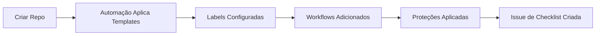
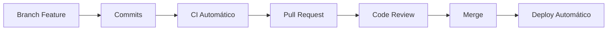
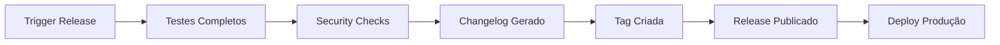

# 🏛️ Governança Organizacional - arturdr-org

> Guia completo de governança, melhores práticas e padrões para toda a organização.

## 📋 Visão Geral

Este documento define as diretrizes de governança, padrões de desenvolvimento e processos automatizados que garantem consistência, qualidade e segurança em todos os repositórios da organização `arturdr-org`.

## 🎯 Objetivos da Governança

### Primários
- 🔄 **Consistência**: Padrões uniformes em todos os projetos
- 🛡️ **Segurança**: Práticas de segurança integradas e automatizadas
- 📊 **Qualidade**: Métricas e validações contínuas
- 🚀 **Eficiência**: Automação de processos repetitivos

### Secundários
- 📚 **Documentação**: Padrões claros e atualizados
- 👥 **Colaboração**: Facilitar contribuições internas e externas
- 🔍 **Transparência**: Visibilidade de processos e métricas
- 🎓 **Aprendizado**: Disseminação de melhores práticas

## 🏗️ Estrutura de Governança

### 🤖 Camada de Automação
```
org-automation/
├── 🎯 Automação Principal (enhanced_automation.py)
├── 🏥 Monitoramento (monitoring.py)  
├── 📊 Dashboard (dashboard.py)
├── ⚙️ Configurações Centralizadas (config/)
└── 🔄 Workflows (workflow-templates/)
```

### 📊 Métricas e KPIs

#### Conformidade (Compliance)
- **Meta**: ≥ 80% de conformidade em todos os repositórios
- **Medição**: Score baseado em labels, templates, proteções, workflows
- **Frequência**: Verificação diária, relatório semanal

#### Qualidade de Código
- **Meta**: ≥ 85% taxa de sucesso em workflows
- **Medição**: Workflows CI/CD, testes automatizados, análises estáticas
- **Frequência**: Monitoramento contínuo

#### Segurança
- **Meta**: Zero vulnerabilidades críticas
- **Medição**: CodeQL, dependency scanning, secret scanning
- **Frequência**: Verificação em cada commit/PR

## 📏 Padrões Organizacionais

### 🏷️ Sistema de Labels

#### Labels Básicas (Obrigatórias)
```yaml
Categoria: Básicas
- bug: Problemas e correções
- enhancement: Novas funcionalidades
- documentation: Atualizações de documentação
- good first issue: Para novos contribuidores
- help wanted: Precisa de ajuda externa
```

#### Labels de Prioridade
```yaml
Categoria: Prioridade
- priority:critical: Correção imediata necessária
- priority:high: Alta prioridade
- priority:medium: Prioridade média
- priority:low: Baixa prioridade
```

#### Labels por Área
```yaml
Categoria: Área/Domínio
- area:automation: Automação e workflows
- area:photo-processing: Processamento de imagens
- area:raw-workflow: Fluxo RAW
- area:metadata: Metadados e EXIF
- area:gimp: Relacionado ao GIMP
```

#### Labels de Status
```yaml
Categoria: Status
- status:in-progress: Em desenvolvimento
- status:blocked: Bloqueado
- status:on-hold: Pausado temporariamente
```

### 📄 Templates Obrigatórios

#### Issue Templates
1. **Bug Report** (`.github/ISSUE_TEMPLATE/bug_report.md`)
   - Descrição detalhada
   - Passos para reproduzir
   - Ambiente e contexto
   - Screenshots se aplicável

2. **Feature Request** (`.github/ISSUE_TEMPLATE/feature_request.md`)
   - Problema relacionado
   - Solução proposta
   - Critérios de aceitação
   - Impacto no usuário

#### Pull Request Template
- **Arquivo**: `.github/PULL_REQUEST_TEMPLATE.md`
- **Conteúdo**: Descrição, tipo de mudança, testes, checklist

#### CODEOWNERS
- **Arquivo**: `.github/CODEOWNERS`
- **Propósito**: Definir proprietários de código para revisões automáticas

### 🔒 Proteções de Branch

#### Branch Principal (main/master)
```yaml
Configurações Obrigatórias:
- Revisões de PR: ≥ 1 aprovação
- Status checks: CI deve passar
- Histórico linear: Requerido
- Force push: Não permitido
- Deletions: Não permitido
```

#### Branch de Desenvolvimento (develop)
```yaml
Configurações Recomendadas:
- Revisões de PR: ≥ 1 aprovação
- Status checks: CI recomendado
- Force push: Permitido (com cuidado)
- Histórico linear: Não obrigatório
```

### 🔄 Workflows CI/CD

#### Por Linguagem

##### Python
- **Template**: `workflow-templates/python-ci.yml`
- **Inclui**: Linting, type checking, testes, security scan, CodeQL
- **Deploy**: Automático para PyPI em releases

##### Node.js/TypeScript
- **Template**: `workflow-templates/nodejs-ci.yml`
- **Inclui**: ESLint, Prettier, testes, E2E, Lighthouse, security audit
- **Deploy**: Automático para NPM em releases

##### Geral (Qualquer Linguagem)
- **Template**: `workflow-templates/basic-ci.yml`
- **Inclui**: YAML lint, Markdown check, Prettier
- **Uso**: Repositórios sem linguagem específica

#### Release Automation
- **Template**: `workflow-templates/release-automation.yml`
- **Funcionalidades**:
  - Geração automática de changelog
  - Versionamento semântico
  - Criação de releases no GitHub
  - Publicação em registries (NPM, PyPI)
  - Modo dry-run para testes

## 🎭 Ciclo de Vida do Desenvolvimento

### 1. Criação de Repositório


### 2. Desenvolvimento


### 3. Release


## 📊 Monitoramento e Métricas

### 🏥 Health Checks
- **Frequência**: 2x por dia (6:00 e 18:00 UTC)
- **Verifica**: Conformidade, workflows, security alerts
- **Alertas**: Issues automáticos para problemas críticos

### 📈 Dashboard Organizacional
- **Atualização**: Diária
- **Métricas**: Compliance, atividade, qualidade, segurança
- **Acesso**: HTML gerado automaticamente

### 📋 Relatórios
- **Semanal**: Segunda-feira 6:00 UTC
- **Conteúdo**: Resumo de atividades, tendências, recomendações
- **Distribuição**: Issues automáticos no repositório org-automation

## 🛠️ Ferramentas e Tecnologias

### Automação
- **Python**: Scripts de automação
- **GitHub Actions**: Workflows CI/CD
- **GitHub API**: Integração com plataforma
- **YAML**: Configurações centralizadas

### Qualidade
- **Linters**: ESLint, Flake8, Prettier
- **Type Checking**: TypeScript, MyPy
- **Testing**: Jest, Pytest, Playwright
- **Coverage**: Codecov

### Segurança
- **CodeQL**: Análise estática de segurança
- **Dependabot**: Atualizações de dependências
- **Secret Scanning**: Detecção de secrets expostos
- **License Checking**: Compliance de licenças

## 🎓 Melhores Práticas

### 📝 Commits
```bash
# Formato recomendado (Conventional Commits)
type(scope): description

# Exemplos
feat(auth): add OAuth2 integration
fix(api): resolve null pointer exception
docs(readme): update installation instructions
chore(deps): update dependencies
```

### 🔄 Branches
```bash
# Padrão de nomenclatura
feature/feature-name
bugfix/issue-description  
hotfix/critical-fix
release/v1.2.0
```

### 📋 Pull Requests
1. **Título Descritivo**: Resumo claro da mudança
2. **Descrição Detalhada**: Contexto e motivação
3. **Testes**: Evidência de que funciona
4. **Breaking Changes**: Destaque mudanças incompatíveis
5. **Screenshots**: Para mudanças visuais

### 🏷️ Issues
1. **Títulos Claros**: Específicos e acionáveis
2. **Labels Apropriadas**: Categoria, prioridade, área
3. **Descrição Completa**: Contexto suficiente
4. **Reprodução**: Passos claros para bugs
5. **Critérios de Aceitação**: Para features

## 🔐 Segurança

### Práticas Obrigatórias
- **Never commit secrets**: Use environment variables
- **Dependencies**: Mantenha atualizadas
- **Permissions**: Princípio do menor privilégio
- **Code Review**: Obrigatório para main branch
- **Security Scanning**: Automático em todos os PRs

### Incident Response
1. **Detecção**: Alerts automáticos
2. **Assessment**: Avaliar impacto
3. **Mitigation**: Ações imediatas
4. **Communication**: Notificar stakeholders
5. **Resolution**: Implementar correções
6. **Post-mortem**: Documentar aprendizados

## 🤝 Contribuições

### Para Membros da Organização
1. Siga todos os padrões definidos
2. Use templates e workflows fornecidos
3. Participe de code reviews
4. Mantenha documentação atualizada
5. Reporte problemas de governança

### Para Contribuidores Externos
1. Leia CONTRIBUTING.md do repositório
2. Use templates de issues e PRs
3. Aguarde revisão de CODEOWNERS
4. Siga padrões de commit
5. Seja respeitoso e construtivo

## 📞 Suporte e Contato

### Issues de Governança
- **Repositório**: arturdr-org/org-automation
- **Labels**: governance, policy, automation
- **Template**: Use template apropriado

### Melhorias no Processo
- **Discussões**: GitHub Discussions
- **RFCs**: Para mudanças significativas
- **Feedback**: Sempre bem-vindo

### Treinamento
- **Documentação**: Este repositório
- **Workshops**: Sob demanda
- **Mentoring**: Programa buddy system

## 🔄 Atualizações

### Versionamento da Governança
- **Semantic Versioning**: Major.Minor.Patch
- **Breaking Changes**: Requer RFC
- **Backward Compatibility**: Sempre que possível

### Change Management
1. **Proposta**: Issue ou RFC
2. **Discussão**: Community feedback
3. **Aprovação**: Maintainers review
4. **Implementação**: Gradual rollout
5. **Documentação**: Atualização docs
6. **Comunicação**: Announce changes

---

## 📚 Referências

- [GitHub Best Practices](https://docs.github.com/en/repositories/creating-and-managing-repositories/best-practices-for-repositories)
- [Conventional Commits](https://www.conventionalcommits.org/)
- [Semantic Versioning](https://semver.org/)
- [Security Best Practices](https://docs.github.com/en/code-security)

---

*Este documento é mantido automaticamente e atualizado conforme a evolução das práticas da organização.*

**Última atualização**: Gerenciado automaticamente pelo sistema de automação  
**Versão**: 2.0.0  
**Próxima revisão**: Trimestral