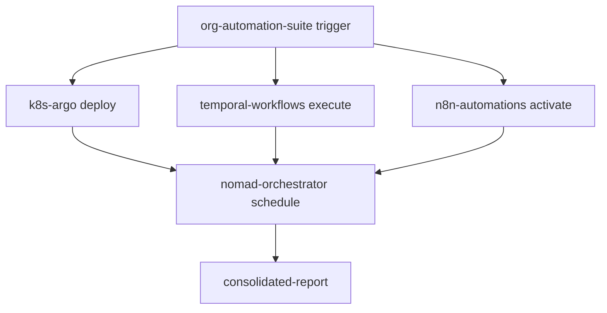

# 🏗️ Arquitetura MCP (Multi-Cloud Platform) - org-automation-suite v3.0

## 📋 Visão Geral

A arquitetura MCP permite **isolamento, escalabilidade e gerenciamento independente** de cada plataforma de automação, mantendo integração central através do `org-automation-suite-suite`.

## 🎯 Filosofia da Arquitetura

### **Princípios Fundamentais**

1. **🔐 Isolamento**: Cada MCP tem seu próprio repositório, dependências e ciclo de vida
2. **📈 Escalabilidade**: Desenvolvimento e deploy independentes por plataforma  
3. **🤝 Integração**: Comunicação via APIs, webhooks e workflows cross-repo
4. **🛡️ Governança**: Controle de acesso específico por repositório/equipe
5. **🔄 Versionamento**: Cada MCP evolui conforme seu próprio ritmo

---

## 🏛️ Estrutura da Arquitetura

### **Repositório Principal: org-automation-suite-suite**

```
org-automation-suite/
├── 🎯 core/                    # Sistema central
│   ├── automation/             # Automação principal
│   ├── monitoring/             # Health checks e dashboard  
│   └── testing/                # Validação e testes
│
├── 📦 modules/                 # Módulos específicos
│   ├── cicd/                   # Templates CI/CD
│   ├── security/               # Segurança e compliance
│   ├── quality/                # Controle de qualidade
│   └── notifications/          # Notificações e alertas
│
├── 🔄 common/                  # Recursos compartilhados
│   ├── config/                 # Configurações centralizadas
│   ├── utils/                  # Utilitários compartilhados
│   └── templates/              # Templates padrão
│
├── 🏗️ mcp-submodules/         # Submódulos MCP
│   ├── k8s-argo/              # Kubernetes + Argo Workflows
│   ├── n8n-automations/        # n8n.io visual workflows
│   ├── temporal-workflows/     # Temporal.io durable execution
│   └── nomad-orchestrator/     # HashiCorp Nomad scheduling
│
├── 📚 docs/                    # Documentação integrada
├── 🧪 tests/                   # Testes estruturados
└── 🛠️ scripts/                 # Scripts auxiliares
```

### **Repositórios MCP Específicos**

Cada repositório MCP mantém sua própria estrutura otimizada:

#### **1. k8s-argo** 🚀
```
k8s-argo/
├── workflows/                  # Argo Workflow definitions
├── manifests/                  # Kubernetes manifests
├── helm/                       # Helm charts
├── scripts/                    # Deployment scripts
├── .github/workflows/          # CI/CD específico
└── docs/                       # Documentação Argo
```

**Responsabilidades:**
- 🔄 Pipelines Kubernetes robustos
- 📊 Workflows de automação escaláveis  
- 🎯 Deploy cloud-native

#### **2. n8n-automations** ⚡
```
n8n-automations/
├── workflows/                  # n8n workflow JSON exports
├── custom-nodes/               # Nodes customizados
├── credentials/                # Templates de credenciais
├── triggers/                   # Webhook triggers
├── .github/workflows/          # CI/CD para n8n
└── docs/                       # Guias de workflow
```

**Responsabilidades:**
- 🎨 Workflows visuais drag-n-drop
- 🔗 Integração de APIs externa
- 🤖 Automação low-code/no-code

#### **3. temporal-workflows** 🛡️
```
temporal-workflows/
├── workflows/                  # Temporal workflow definitions
├── activities/                 # Activity implementations
├── workers/                    # Worker configurations
├── schedules/                  # Cron schedules
├── .github/workflows/          # CI/CD para Temporal
└── docs/                       # Documentação Temporal
```

**Responsabilidades:**
- 💪 Execução durável e fault-tolerant
- 🔄 Long-running processes
- 📈 Workflows distribuídos confiáveis

#### **4. nomad-orchestrator** 🎯
```
nomad-orchestrator/
├── jobs/                       # Nomad job specifications
├── policies/                   # ACL policies
├── configs/                    # Configuration files
├── scripts/                    # Deployment helpers
├── .github/workflows/          # CI/CD para Nomad
└── docs/                       # Guias Nomad
```

**Responsabilidades:**
- 🏃‍♂️ Orquestração leve e flexível
- 📦 Container scheduling
- 🎛️ Resource management

---

## 🔄 Padrões de Integração

### **1. Submódulos Git**

```bash
# Adicionar submódulos MCP
git submodule add https://github.com/arturdr-org/k8s-argo.git mcp-submodules/k8s-argo
git submodule add https://github.com/arturdr-org/n8n-automations.git mcp-submodules/n8n-automations
git submodule add https://github.com/arturdr-org/temporal-workflows.git mcp-submodules/temporal-workflows  
git submodule add https://github.com/arturdr-org/nomad-orchestrator.git mcp-submodules/nomad-orchestrator

# Atualizar submódulos
git submodule update --init --recursive
git submodule update --remote
```

### **2. APIs REST**

**Endpoint de Coordenação:**
```
POST /api/v1/mcp/{platform}/trigger
GET  /api/v1/mcp/{platform}/status
PUT  /api/v1/mcp/{platform}/config
```

**Exemplo de uso:**
```bash
# Disparar workflow no Temporal
curl -X POST https://api.org-automation-suite.arturdr-org.com/v1/mcp/temporal/trigger \
  -H "Authorization: Bearer ${TOKEN}" \
  -d '{"workflow": "org-sync", "params": {"org": "arturdr-org"}}'
```

### **3. Webhooks & Eventos**

**GitHub Actions Cross-Repo:**
```yaml
# No repositório MCP
- name: "📤 Notify Main Repo"
  run: |
    curl -X POST \
      -H "Authorization: token ${{ secrets.GITHUB_TOKEN }}" \
      "https://api.github.com/repos/arturdr-org/org-automation-suite/dispatches" \
      -d '{"event_type": "mcp-update", "client_payload": {"repo": "k8s-argo", "status": "success"}}'
```

**Webhook Handler no org-automation-suite:**
```yaml
on:
  repository_dispatch:
    types: [mcp-update]

jobs:
  handle-mcp-update:
    runs-on: ubuntu-latest
    steps:
    - name: Process MCP Update
      run: |
        echo "MCP ${{ github.event.client_payload.repo }} status: ${{ github.event.client_payload.status }}"
```

### **4. Workflows Coordenados**

**Pipeline Orquestrado:**


---

## 📊 Governança e Controle

### **Controle de Acesso**

| Repositório | Equipe | Permissões |
|-------------|--------|------------|
| `org-automation-suite` | Core Team | Admin |
| `k8s-argo` | DevOps/SRE | Maintain |
| `n8n-automations` | Automation Team | Write |
| `temporal-workflows` | Backend Team | Write |
| `nomad-orchestrator` | Infrastructure Team | Write |

### **Versionamento Coordenado**

```yaml
# .github/workflows/mcp-sync.yml
name: "🔄 MCP Version Sync"

on:
  release:
    types: [published]

jobs:
  update-submodules:
    runs-on: ubuntu-latest
    steps:
    - name: Update MCP Submodules
      run: |
        git submodule foreach 'git checkout main && git pull'
        git add mcp-submodules/
        git commit -m "chore: sync MCP submodules to latest versions"
```

### **Políticas de Deploy**

1. **Desenvolvimento**: Deploy automático em branches `develop` de cada MCP
2. **Staging**: Deploy coordenado após aprovação em PRs
3. **Produção**: Deploy orquestrado via `org-automation-suite` com rollback automático

---

## 🚀 Fluxo de Desenvolvimento

### **Cenário 1: Nova Funcionalidade em MCP Específico**

```bash
# 1. Developer trabalha no repositório MCP
git clone https://github.com/arturdr-org/k8s-argo.git
cd k8s-argo
git checkout -b feature/new-pipeline

# 2. Desenvolve e testa localmente  
# 3. Cria PR no repositório MCP
# 4. CI/CD do MCP executa testes
# 5. Após merge, notifica org-automation-suite
# 6. org-automation-suite atualiza submódulo
```

### **Cenário 2: Mudança Cross-MCP**

```bash
# 1. Mudança coordenada via org-automation-suite
git clone https://github.com/arturdr-org/org-automation-suite.git
cd org-automation-suite
git checkout -b feature/cross-mcp-update

# 2. Atualiza múltiplos submódulos
git submodule foreach 'git checkout -b feature/coordinated-change'

# 3. Implementa mudanças em cada MCP
# 4. Cria PRs coordenados
# 5. Merge sequencial com validação
```

### **Cenário 3: Deploy de Produção**

```bash
# 1. Tag de release no org-automation-suite
git tag -a v3.1.0 -m "Release v3.1.0 with MCP updates"
git push origin v3.1.0

# 2. Pipeline orquestrado executa:
# - Build e test de todos os MCPs
# - Deploy coordenado por prioridade
# - Validação cross-platform
# - Rollback automático se falha
```

---

## 📈 Benefícios da Arquitetura MCP

### **✅ Vantagens**

1. **🔐 Isolamento Completo**: Falhas em um MCP não afetam outros
2. **📈 Escalabilidade**: Equipes podem trabalhar independentemente  
3. **🎯 Especialização**: Cada repositório otimizado para sua plataforma
4. **🔄 Flexibilidade**: Deploy e versionamento independente por necessidade
5. **🛡️ Segurança**: Controle de acesso granular por funcionalidade
6. **⚡ Performance**: Repositórios menores e mais focados
7. **🤝 Colaboração**: Equipes distribuídas podem contribuir em paralelo

### **⚠️ Considerações**

1. **Complexidade de Coordenação**: Requer orquestração cuidadosa
2. **Overhead de Manutenção**: Múltiplos repositórios para manter
3. **Sincronização**: Versões podem divergir se não coordenadas
4. **Debugging Cross-MCP**: Mais complexo rastrear problemas distribuídos

---

## 🛠️ Ferramentas de Apoio

### **Monitoramento Distribuído**

```python
# Centralizado no org-automation-suite
class MCPMonitor:
    def check_mcp_health(self):
        mcps = ['k8s-argo', 'n8n-automations', 'temporal-workflows', 'nomad-orchestrator']
        
        for mcp in mcps:
            # Verificar API health endpoint
            # Validar últimas execuções
            # Consolidar métricas
```

### **Dashboard Unificado**

- 📊 Status de todos os MCPs em um só lugar
- 🔄 Histórico de execuções cross-platform
- 🚨 Alertas consolidados
- 📈 Métricas agregadas

### **Automação de Sincronização**

```yaml
# Workflow que mantém submódulos atualizados
- name: Daily MCP Sync
  schedule:
    - cron: '0 6 * * *'  # 6 AM UTC daily
  
  steps:
  - name: Update Submodules
    run: |
      git submodule update --remote --merge
      if [[ -n $(git status --porcelain) ]]; then
        git commit -am "chore: sync MCP submodules $(date)"
        git push
      fi
```

---

## 📚 Próximos Passos

1. **🏗️ Criar repositórios MCP**: Executar `scripts/create_mcp_repos.py`
2. **🔗 Configurar submódulos**: Adicionar cada MCP como submódulo
3. **⚙️ Implementar integrações**: APIs, webhooks e workflows cross-repo
4. **📊 Configurar monitoramento**: Dashboard centralizado e alertas
5. **👥 Definir equipes**: Controle de acesso e responsabilidades
6. **📖 Documentar processos**: Guias de desenvolvimento e deploy

---

**🎯 Meta**: Criar o ecossistema de automação mais robusto, escalável e maintível da organização `arturdr-org`!

_Arquitetura viva - atualizada conforme evolução dos MCPs_