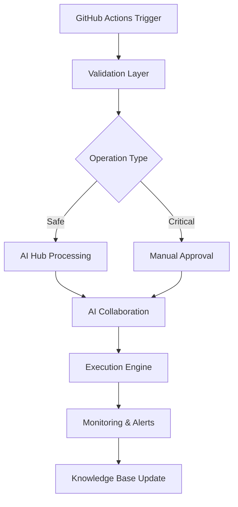
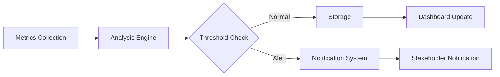

# 🏗️ Arquitetura do Sistema org-automation-suite

## 📋 Visão Geral da Arquitetura

O org-automation-suite é um sistema de automação baseado em IA colaborativa, projetado com arquitetura modular e escalável para gerenciamento inteligente de infraestrutura.

## 🎯 Princípios Arquiteturais

### 1. **Modularidade**
- Separação clara de responsabilidades
- Acoplamento baixo entre componentes
- Alta coesão dentro dos módulos

### 2. **Escalabilidade**
- Processamento assíncrono
- Sistema de filas com priorização
- Suporte a múltiplos provedores AI

### 3. **Segurança**
- Validação em múltiplas camadas
- Modo dry-run obrigatório para testes
- Auditoria completa de operações

### 4. **Observabilidade**
- Logging estruturado
- Métricas em tempo real
- Alertas contextuais

## 🏗️ Componentes Principais

### Core System (`core/`)
```
core/
├── automation/     # Motor de automação principal
├── monitoring/     # Sistema de monitoramento
└── dashboard/      # Interface de visualização
```

**Responsabilidades:**
- Execução de operações automatizadas
- Coleta e análise de métricas
- Interface para visualização de dados

### Modules (`modules/`)
```
modules/
├── cicd/           # Integração/Entrega Contínua
├── security/       # Módulos de segurança
├── quality/        # Controle de qualidade
└── notifications/  # Sistema de notificações
```

**Responsabilidades:**
- Funcionalidades específicas por domínio
- Integrações com ferramentas externas
- Políticas de negócio especializadas

### Shared Resources (`shared/`)
```
shared/
├── config/         # Configurações globais
├── utils/          # Utilitários comuns
└── templates/      # Templates reutilizáveis
```

**Responsabilidades:**
- Recursos compartilhados entre módulos
- Configurações centralizadas
- Templates e utilitários comuns

## 🤖 Sistema AI-Powered

### AI Integration Hub
- **Localização**: `scripts/ai-integration-hub.py`
- **Função**: Coordenação entre múltiplas IAs
- **Provedores**: Claude, GPT, Gemini, Warp Agent
- **Padrão**: Producer-Consumer com filas priorizadas

### AI Manual Parser
- **Localização**: `scripts/ai-manual-parser.py`
- **Função**: Interpretação e execução de comandos
- **Fonte**: Manual de operações estruturado
- **Segurança**: Validação obrigatória antes da execução

## 🔄 Fluxos de Dados

### Fluxo de Automação Principal


### Fluxo de Monitoramento


## 🔧 Integrações Externas

### GitHub Integration
- **API**: GitHub REST API v4
- **Autenticação**: GitHub App (recomendado) ou PAT
- **Scope**: Repositórios da organização arturdr-org

### AI Providers
- **Claude**: Análise e tomada de decisões
- **GPT**: Geração de soluções e suporte
- **Gemini**: Processamento e validação
- **Warp Agent**: Execução local e coordenação

### Notification Systems
- **Slack**: Alertas operacionais
- **PagerDuty**: Incidentes críticos
- **Email**: Relatórios periódicos

## 📊 Padrões de Design

### Repository Pattern
- Separação entre lógica de negócio e persistência
- Interfaces bem definidas para acesso a dados

### Command Pattern
- Encapsulamento de operações como objetos
- Suporte a undo/redo e logging

### Observer Pattern
- Notificações baseadas em eventos
- Baixo acoplamento entre componentes

### Strategy Pattern
- Múltiplas implementações de algoritmos
- Seleção dinâmica de estratégias AI

## 🛡️ Segurança

### Camadas de Validação
1. **Input Validation**: Sanitização de entrada
2. **Authorization**: Verificação de permissões
3. **Business Rules**: Validação de regras de negócio
4. **Execution**: Modo dry-run obrigatório

### Auditoria
- Log estruturado de todas as operações
- Rastreabilidade completa de mudanças
- Retenção configurável de logs

## 📈 Performance e Escalabilidade

### Processamento Assíncrono
- Uso extensivo de asyncio
- Processamento em paralelo quando possível
- Timeouts configuráveis

### Cache Strategy
- Cache de resultados AI frequentes
- Invalidação inteligente baseada em contexto
- Políticas de TTL configuráveis

### Load Balancing
- Distribuição inteligente entre provedores AI
- Failover automático em caso de falhas
- Otimização baseada em custo/performance

## 🔮 Evolução da Arquitetura

### Próximas Melhorias
- [ ] Microservices architecture
- [ ] Event-driven architecture
- [ ] Kubernetes deployment
- [ ] Service mesh integration
- [ ] Distributed caching
- [ ] Real-time analytics

### Métricas de Qualidade
- Code Coverage > 80%
- Response Time < 2s para operações críticas
- Uptime > 99.9%
- AI Decision Accuracy > 95%

